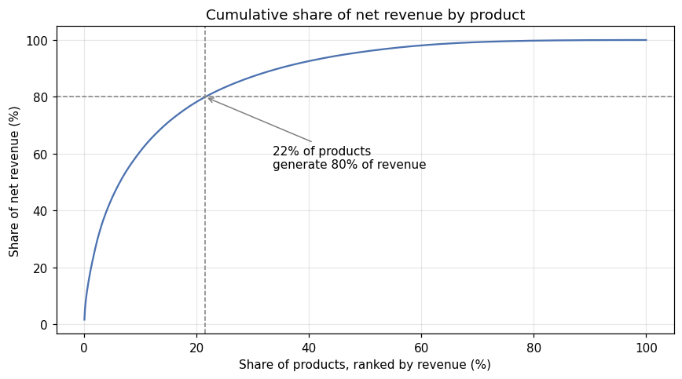
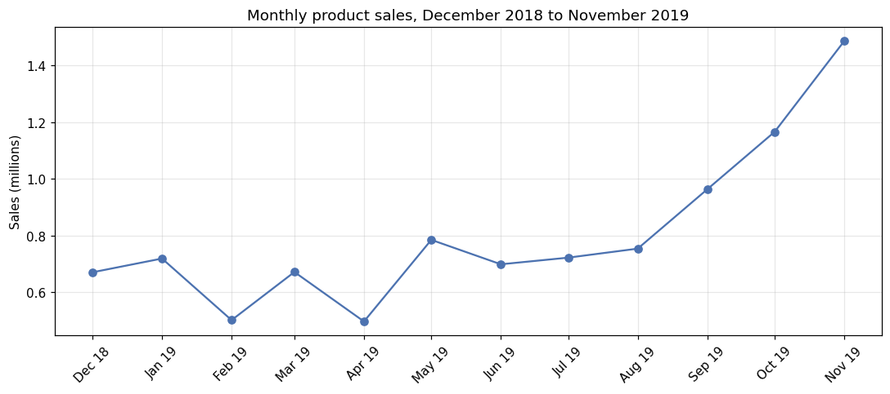

# E-commerce Product Range Analysis

## Overview

This project analyses about one year of transactions from an online store selling household goods and gifts. The aim is to identify which products drive the business, how demand changes through the year, how concentrated the customer base is, and what the store should do with its product range.

## Data

The dataset contains 541,909 transaction lines from 29 November 2018 to 7 December 2019, with order and item identifiers, product descriptions, quantities, unit prices, invoice dates and customer IDs. It is included in the repository as `ecommerce_dataset_us.zip`, which the notebook reads directly.

## Approach

The raw data required substantial cleaning. Duplicate rows were removed; postage, fees, discounts, manual adjustments and gift vouchers were separated from genuine products; internal stock write-offs were excluded; and cancellations were kept in a separate table so they could be netted off product sales. The analysis then covers monthly sales trends over the twelve full months, an ABC analysis of the product range based on net revenue, the role of seasonal products, cancellation patterns, RFM customer segmentation, and two hypothesis tests: a Spearman correlation between price and units sold, and a Kruskal–Wallis test of differences in daily sales across seasons.

## Key Findings

The product range is highly concentrated. About 22% of products generate 80% of net revenue, while 53% of products together contribute only 5%.

Demand is strongly seasonal. Monthly sales roughly double between spring and November, and the autumn surge covers the whole range rather than only Christmas items, consistent with retailers stocking up for the holidays. Daily units sold differ significantly across seasons (Kruskal–Wallis p < 0.001).

Product sales total about 10.2 million before cancellations and 9.8 million after, with cancellations equal to 4.6% of gross sales. Revenue depends heavily on a small group of customers: the top 10% generate 61% of revenue, and the most active segment, about a quarter of customers, generates two-thirds. Around 35% of customers ordered only once. Across products, lower-priced items sell in much larger quantities (Spearman's ρ = −0.38).

Cleaning changed several conclusions. Without it, postage appears as the top-earning product, a single fully cancelled order of 80,995 units makes an item look like a best seller, and incomplete data for December 2019 creates a false drop in sales.

## Recommendations

The store should protect stock availability of its top-performing products, particularly before the September to November peak, and review its low-contributing products for discontinuation or bundling. A dedicated programme for high-value repeat buyers would protect the revenue base, a follow-up offer after the first purchase could convert more one-time shoppers, and unusually large orders should be confirmed before fulfilment to reduce cancellations.

## Skills Demonstrated

This project demonstrates data cleaning and validation on messy transactional data, ABC (Pareto) analysis, RFM customer segmentation, time-series aggregation, non-parametric hypothesis testing, and translating analysis into business recommendations.

## How to Run

Install the dependencies with `pip install -r requirements.txt` and open `ecommerce_product_range_analysis.ipynb` in Jupyter.

## Tools

Python, pandas, NumPy, SciPy, Matplotlib and Jupyter Notebook.
